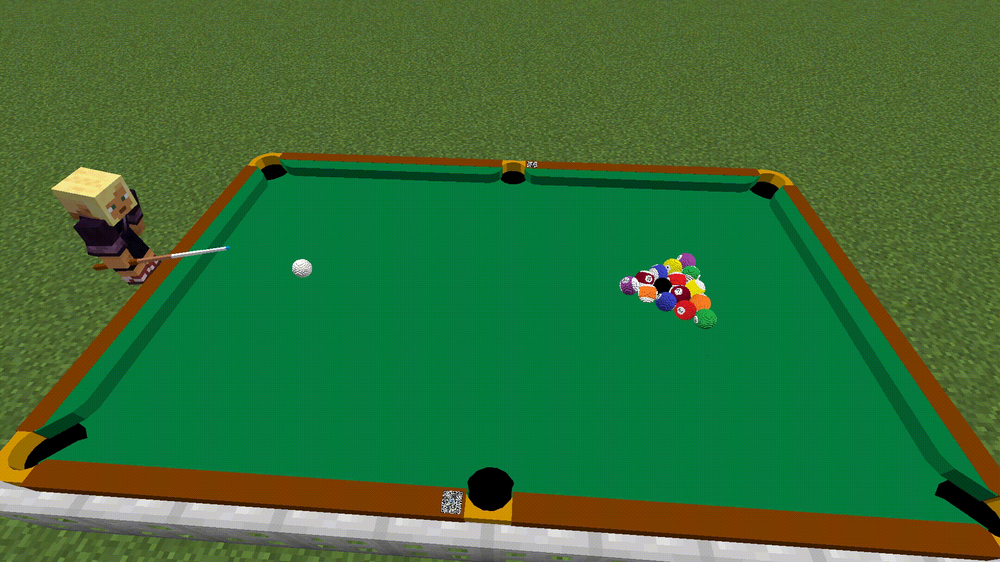

## [中文版使用说明](https://github.com/MingshiYangUIUC/Pool-Evolved-Minecraft-Squid-Workshop-Project/blob/main/%E4%BD%BF%E7%94%A8%E8%AF%B4%E6%98%8E.md)

## Recent Updates

### July 2025 — Updated Datapack for 1.20 and 1.21. Pool Datapack now supports all Minecraft versions since 1.16!
Minecraft 1.21.X introduced directory structure changes and significant command syntax updates. It is no longer feasible to support multiple versions within a single datapack file. The resourcepack also underwent several changes. \
Based on the 1.16-1.20 modules, the datapack and resourcepack are generated using an [automated script](build_packs_for_1.21.py) that makes necessary changes to let the modules work as intended in new Minecraft versions.

🔴If you're playing Minecraft 1.21.X, please use the datapack and resource pack that match your game version.  
🔴You no longer need to select versions after loading the datapack in game.  
🔴Please also make sure you're using the 1.21 version of the [Math Datapack](https://github.com/MingshiYangUIUC/Math-Minecraft-Squid-Workshop-Project).  
🔴Currently, the express installation script for Windows users does NOT support installing 1.21.X versions.

# _Squid Workshop's_ Pool Datapack
Content creator: Mingshi Yang (YMS2001). Contact: mingshi3@illinois.edu

*I am replacing the math module with a better organized collection: [Math Datapack](https://github.com/MingshiYangUIUC/Math-Minecraft-Squid-Workshop-Project). Please include its latest version in your datapack directory.*

Play [pool](https://en.wikipedia.org/wiki/Pool_(cue_sports)) in Minecraft, like in real life!

- [Abstract](#Abstract)
- [Installation](#Installation)
- [Usage](#Usage)
- [How It Works](#How-It-Works)
- [Notes](#Notes)
- [Terms of Use](#Terms-of-Use)
- [More About Squid Workshop](#More-About-Squid-Workshop)

# Abstract
This datapack is for pool lovers. _Pool_ here means cue sport including _Snooker_, _Billiards_, _8/9 Ball_, etc.

Pool datapack supports singleplayer and duo games with Minecraft Java Edition 1.16+. The pack is computationally heavy, it supports only one active table in a Minecraft world.

Supported game modes are _practice_, _snooker_, and _UK 8 ball_.

	
# Installation

### Windows Users
[`swPool_sync.bat`](https://github.com/MingshiYangUIUC/Pool-Minecraft-Squid-Workshop-Project/blob/main/swPool_sync.bat) is a script that automatically downloads / updates **Pool Datapack** and its required **Math Datapack** and **Resourcepack** from GitHub.  
⚠️ **DO NOT USE** if you have custom modifications, because the current Pool / Math Datapacks you downloaded before will be deleted.

### Alternative Step by Step Installation
- Step 01 Download this repository as a zip and unpack.
- Step 02 Go to minecraft directory, usually "C:/Users/youUserName/AppData/Roaming/.minecraft".
- Step 03 Move your "Pool-ResourcepackFolder-Squid-Workshop" folder(not the root folder) into .../resourcepacks folder. Pack compatible with 1.16+.
- Step 04 Choose the world folder in which you want to install the packs. Go to .../saves/world/datapacks folder.
- Step 05 Move your "Pool-Datapack-Squid-Workshop-1.16-1.19" folder(not the root folder) into .../saves/world/datapacks folder.
- Step 06 Open Minecraft and open the world.
- Step 07 Press Esc, click options... and resourcepacks... and move Pool-Resourcepack-Squid-Workshop-1.16.5 to the upper right. Do this everytime you change the game version.
- Step 08 Type "/reload" command then press enter.
- Step 09 Enjoy 

PS: If not working, check whether the datapack is enabled by:

	/datapack list
Enable it by:

	/datapack enable "datapackname"
## Compatibility Notice
The datapack and resourcepack will work for various game versions, although the game may notify you the packs are incompatible when you install them. Nonetheless, you can follow this [page](https://minecraft.fandom.com/wiki/Pack_format) and modify pack.mcmeta files according to your game version. 

**Please let me know if the packs are actually incompatible with any versions higher than Java Edition 1.16.1.**
  
# Usage
## Interactions
Most interactions do not require typing. You just need to click on texts in <<ins>this format</ins>> or choose functions suggested by the game in command line. 

You will be displayed a piece of <<ins>Clickable text</ins>> to open the "command window" after (re)loaded the datapack, try clicking on the text and explore. You can get the command window by running this command at any time:

	/function app:help/pool/commandwindow

If the pack is _(re)installed_, please follow the instruction, choose the language, game version, and set the friction coefficients by clicking the texts. You can also use the following command to modify friction later. Otherwise, there will be zero friction (you may try it for fun)!

	/function app:settings/pool/friction/
Suggested values: Impact:100-200, Rolling:150-300, Sliding:1500-3000, Striking:6000-8000. Extereme values may cause the scoreboard calculations to overflow and the game may behave unexpectedly.

Beside the friction coefficients, other settings such as undoing the stroke and reloading can be modified. Please find the explanation of settings by clicking <<ins>Help about Settings</ins>> at bottom of command window.

	/function app:settings/
Note: Please turn off "Force Unicode" for better experience.

## Hitting the ball
When you are holding the cue stick, press right button to charge, the longer you hold the right button, the more power the strike is. The cue ball will be moving towards your facing direction.

When you are holding the cue stick, press shift to face the cue ball.

You can choose whether you will be applied slowness effect when pressing shift. This may help you aim, but is not recommended without smooth connection. You can set by completing the following command.

	/function app:settings/pool/aim/
Before each strike you can click <<ins>Adjust the next strike angles</ins>> to change the strike positions and angles. Or using the following command.

	/function pool:classes/cue/map
In this map, grid points represent where cue stick should hit the cue ball. Cue stick lifting angle can be adjusted at the right side. Fine tuning of cue ball hit point can be done using buttons at the bottom. 

## Ball in hand
When the cue ball leaves table, the player having it in hand needs to place it back on the table. Valid placements will be indicated by green particles when the player is standing on the table or on the ground near the table. 

## Basic Instructions
Install the datapack following instructions of the [Installation](#Installation) section.

When prompted, set language, game version, friction parameters, and how the player scores will be displayed.

Click to open the command window, get the cue stick, explore the [settings](#settings) and change them if you want.

Click to set a new table if you haven't done so. Choose two side lengths of the table and place it following text prompts.

Open the game lobby in command window, if you want to participate in multiplayer game, you can click to join the queue beginning with MP. After you join a queue, other players will receive your invitation and are able to join you.

You will be notified when another player joins your queue. Click on BEGIN! to play with that player. 

You can also play singleplayer mode, in singleplayer Snooker you just try to score more than you foul. In singleplayer UK 8 Ball you just pretend to be two players, so there is no win or loss in this game.

After a snooker game finishes, players will receive a rating based on average point they get per strike (per turn).

You can initialize practice mode from command window or enter it in the middle of any other games. In practice mode you can place the balls anywhere and there will be no rules.

You can terminate the game at any time using the command window.

# How It Works
Conservation of momentum and angular momentum and energy, recently added interactions with edge of pockets (friction is neglected there) and simulation of cue stick - cue ball interactions. Neglected deformations.

# Notes
1. I am aware of that everything looks amplified, while comparing to reality. This also affects the physics as the radii of balls are one of the most closely related parameters to the physical behaviors. However, the common setting of mouse sensitivity does not provide enough fineness of controlling the cuestick and aiming direction, and it will be much harder to play the game if the balls size are reduced to mimic the real pool balls. Sorry for any "unrealistic concerns" brought to you by my "disloyalty" to the reality.
2. Although the theoretical content is mostly common knowledge, please do not redistribute without crediting us sufficiently. I have not consulted or cited any specific references while making the physics work. See the _detailed physics_ link above or try search "not so simple billiards physics" online.
3. The [rules](https://en.wikipedia.org/wiki/Rules_of_snooker) of snooker and [rules](https://en.wikipedia.org/wiki/Blackball_(pool)) of 8 ball have been simplified to meet popular gameplay. It is likely that the rules are less strict in this datapack and sorry for any incorrectness. The 2005 dimension of pockets on a snooker table is included in the resourcepack as images.

# Terms of Use
This section shall be honored when in conflict with other documents, including the license. \
Feel free to play around with this datapack. \
As developer, feel free to use this datapack as a module to develop free datapacks. \
But you **must** notify us and add the link to this github page! \
**NO COMMERCIAL USE, POTENTIALLY (AT SQUID MINECRAFT WORKSHOP'S DISCRETION) COMMERTIAL USE WITHOUT PROMISSION IS ALSO PROHIBITED.** 
## License
[Mozilla Public License 2.0](https://github.com/MingshiYangUIUC/Autoaim-Minecraft-Squid-Workshop-Project/blob/main/LICENSE)

# More About Squid Workshop
More datapacks developed by us [here](https://github.com/Squid-Workshop/MinecraftDatapacksProject) \
Watch our videos on youtube [here](https://www.youtube.com/channel/UCwPMgfjjh2d7fFqQ1PXHP7w) \
Watch our videos on bilibili [here](https://space.bilibili.com/649645265?from=search&seid=778816111336987286) \
Join our QQ group: 74681732 \
Subscribe on wechat: 鱿鱼MC工作室 
