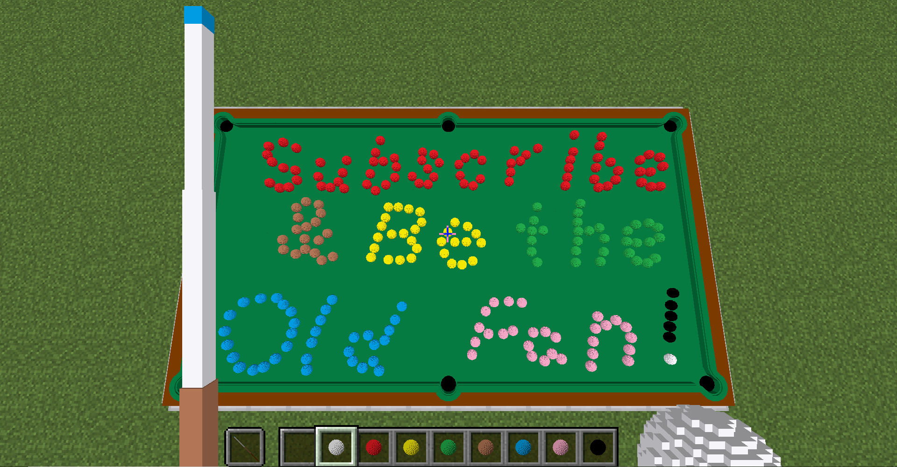

# _Squid Workshop's_ Pool Datapack
[中文版使用说明](https://github.com/MingshiYangUIUC/Pool-Evolved-Minecraft-Squid-Workshop-Project/blob/main/%E4%BD%BF%E7%94%A8%E8%AF%B4%E6%98%8E.md)

Play [pool](https://en.wikipedia.org/wiki/Pool_(cue_sports)) in Minecraft, like in real life!

- [Abstract](#Abstract)
- [Installation](#Installation)
- [Usage](#Usage)
- [How It Works](#How-It-Works)
- [Notes](#Notes)
- [Project Tree](#Project-Tree)
- [Terms of Use](#Terms-of-Use)
- [More About Squid Workshop](#More-About-Squid-Workshop)

# Abstract
This datapack is for pool lovers. _Pool_ here means cue sport including _Snooker_, _Billiards_, _8/9 Ball_, etc.

Pool datapack supports singleplayer and duo games with Minecraft Java Edition 1.16+. The pack is somehow computationally heavy and complex, it supports only one active table in a Minecraft world. Let us hope minecraft datapacks run much faster in the future.

Supported game modes are _practice_, _snooker_, and _UK 8 ball_.

Compatible with Minecraft Java Edition 1.16+.

## Product Spec
- 6800 entity selectors
- 5100 tag usage
- 4200 lines of code
- 2300 scoreboard operations
- 1600 execute operations
- 400 entity data operations
- 250 tellraw messages
- 230 unique functions
- 150 teleport commands
- 80 hours spent developing
- 70 possible table shapes
- 63 scoreboard objectives
- 41 max armor stands in a game
- 27 equations derived
- 5 degrees of freedom

	
# Installation
- Step 01 Download this repository as a zip and unpack.
- Step 02 Go to minecraft directory, usually "C:/Users/youUserName/AppData/Roaming/.minecraft".
- Step 03 Move your "Pool-Resourcepack-Squid-Workshop-1.16.5" folder(not the root folder) into .../resourcepacks folder. Pack compatible with 1.17.
- Step 04 Choose the world folder in which you want to install the packs. Go to .../saves/world/datapacks folder.
- Step 05 Move your "Pool-Evolved-Datapack-Squid-Workshop-1.16-1.17" folder(not the root folder) into .../saves/world/datapacks folder.
- Step 06 Open Minecraft and open the world.
- Step 07 Press Esc, click options... and resourcepacks... and move Pool-Resourcepack-Squid-Workshop-1.16.5 to the upper right. Do this everytime you change the game version.
- Step 08 Type "/reload" command then press enter.
- Step 09 Enjoy

PS: If not working, check whether the datapack is enabled by:

	/datapack list
Enable it by:

	/datapack enable "datapackname"
  
# Usage
Most interactions do not require heavy typing. You just need to click on texts in <<ins>this format</ins>> or choose functions suggested by the game in command line. 

You will be displayed a piece of <<ins>Clickable text</ins>> to open the "command window" after (re)loaded the datapack, try clicking on the text and explore, or wait for the writeup.

If the pack is _(re)installed_, please follow the instruction, choose the language, game version, and set the friction coefficients by clicking the texts. You can also use the following command to modify friction later. Otherwise, there will be zero friction (you may try it for fun)!

	/function app:settings/pool/friction/
Suggested values: Impact:100-200, Rolling:150-300, Sliding:1500-3000, Striking:6000-8000. Extereme values may cause the scoreboard to overflow during calculations.

Beside the friction coefficients, other settings such as redoing the stroke and reloading can be modified. Please consult the settings explained below.

	/function app:settings/
Note: problems may occur if this datapack is enabled together with [the original pool datapack](https://github.com/MingshiYangUIUC/Pool-Minecraft-Squid-Workshop-Project). Please turn off "Force Unicode" while playing.

## Basic Instructions
Install the datapack following instructions of the [Installation](#Installation) section.

When prompted, set language, game version, friction parameters, and how the player scores will be displayed.

Click to open the command window, explore the [settings](#settings) and change them if you want.

Click to set a new table if you haven't done so. Choose two side lengths of the table and place it following text prompts.

Open the game lobby in command window, if you want to participate in multiplayer game, you can click to join the queue beginning with MP. After you join a queue, other players will receive your invitation and are able to join you.

You will be notified when another player joins your queue. Click on BEGIN! to play with that player. 

You can also play singleplayer mode, in singleplayer Snooker you just try to score more than you foul. In singleplayer UK 8 Ball you just pretend to be two players, so there is no win or loss in this game.

After a snooker game finishes, players will receive a rating based on average point they get per strike (per turn).

You can terminate the game at any time using the command window.

_Under Development:_ Each window will eventually be attached a clickable instruction in game.

# How It Works
Conservation of momentum and angular momentum and energy, recently added interactions with edge of pockets (friction is neglected there) and simulation of cue stick - cue ball interactions. Neglected deformations.

The [detailed physics](https://drive.google.com/file/d/18CSY8MuYcNKqhW4IkWf4lJV6wYUuCXp9/view?usp=sharing) I have derived and used is summarized. Although the content is mostly common knowledge, please do not redistribute without crediting us sufficiently.

I have not cited any specific references while making the physics work. See the _detailed physics_ link above or try search "not so simple billiards physics" online.

The [rules](https://en.wikipedia.org/wiki/Rules_of_snooker) of snooker and [rules](https://en.wikipedia.org/wiki/Blackball_(pool)) of 8 ball have been simplified to meet popular gameplay. The 2005 dimension of pockets on a snooker table is included in the resourcepack as images.

I suggest you try the [simpler version](https://github.com/MingshiYangUIUC/Pool-Minecraft-Squid-Workshop-Project) if the game is slow! It is no longer being updated though.

# Notes
1. I am aware of that everything looks amplified, while comparing to reality. This also affects the physics as the radii of balls are one of the most closely related parameters to the physical behaviors. However, the common setting of mouse sensitivity does not provide enough fineness of controlling the cuestick, and it will be much harder to play the game if the balls size are reduced to mimic the real pool balls. Sorry for any "unrealistic concerns" brought to you by my "disloyalty" to the reality.

# Project Tree
## Settings
### (to be updated)
	data/app/functions/settings                Comment
	+---cheating                               Self explanatory
	|       allow.mcfunction                   
	|       disallow.mcfunction                
	|       
	+---friction                               Set coefficients of frictions
	|       clear.mcfunction                           Clear all values
	|       default.mcfunction                         Use default values for all entries below
	|       impact.mcfunction                          indiv. value setting
	|       rolling.mcfunction                         indiv. value setting
	|       sliding.mcfunction                         indiv. value setting
	|       striking.mcfunction                        indiv. value setting
	|       
	+---language                               Self explanatory
	|       chinese_simplified.mcfunction              
	|       english.mcfunction                         
	|       
	+---reload                                 Upon Reload...
	|       cleanongoingsession.mcfunction             Clear the current game session when you reload the pack
	|       keepongoingsession.mcfunction              Not clear the current game session when you reload the pack
	|       
	\---version                                The game version of the map
		1_16.mcfunction                            1.16.x
		1_17.mcfunction                            1.17.x and above (tentative)
		reset.mcfunction                           

Other directories are omitted.
	
# Terms of Use
This section shall be honored when in conflict with the license or other documents. \
Feel free to play around with this datapack. \
As developer, feel free to use this datapack as a module to develop free datapacks. \
But you **must** add the link to this github page! \
**NO COMMERCIAL USE** \
**POTENTIALLY (AT MY DISCRETION) COMMERTIAL USE WITHOUT PROMISSION IS PROHIBITED AND MAY BE PROSECUTED** 
## License
[Mozilla Public License 2.0](https://github.com/MingshiYangUIUC/Autoaim-Minecraft-Squid-Workshop-Project/blob/main/LICENSE)

# More About Squid Workshop
See more datapacks developed by us [here](https://github.com/Squid-Workshop/MinecraftDatapacksProject) \
Watch our videos on bilibili [here](https://space.bilibili.com/649645265?from=search&seid=778816111336987286) \
Join our QQ group: 74681732 \
Subscribe on wechat: 鱿鱼MC工作室 
