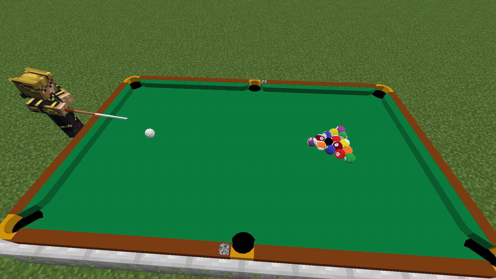

## [中文版使用说明](https://github.com/MingshiYangUIUC/Pool-Evolved-Minecraft-Squid-Workshop-Project/blob/main/%E4%BD%BF%E7%94%A8%E8%AF%B4%E6%98%8E.md)

## Recent Big Updates

### July 2025 — Chinese 8 Ball game is added to the datapack. Join it from the lobby and enjoy!

It has been a long journey...

- Initially, the balls were rendered statically, moving only linearly without any visual spin. I did not plan to add numbered balls, and only designed Snooker and UK 8 Ball with monochromatic balls.
- Later, after significant work on math and physics, cue ball control and advanced ball movements with visual spinning were supported by the Pool Datapack.
- Then, the design to transform ball spin into armor stand pose changes laid the foundation for visually realistic rendering. Numbered balls were introduced in practice mode, even before Minecraft 1.20 and Transformation Rendering were added.
- Finally, the rules for Chinese 8 Ball are implemented in Minecraft now, enabling a fully playable single-player and multiplayer experience with numbered balls.

### July 2025 — Updated Datapack for 1.20 and 1.21. Pool Datapack now supports all Minecraft versions since 1.16!
Minecraft 1.21.X introduced directory structure changes and significant command syntax updates. It is no longer feasible to support multiple versions within a single datapack file. The resourcepack also underwent several changes.  
Based on the 1.16-1.20 modules, the datapack and resourcepack are generated using an [automated script](build_packs_for_1.21.py) that makes necessary changes to let the modules work as intended in new Minecraft versions.

🔴If you're playing Minecraft 1.21.X, please use the datapack and resource pack that match your game version. Find them in the Releases_1.21 folder.  
🔴You no longer need to select versions after loading the datapack in game.  
🔴Please also make sure you're using the 1.21 version of the [Math Datapack](https://github.com/MingshiYangUIUC/Math-Minecraft-Squid-Workshop-Project).  
🔴Currently, the express installation script for Windows users does NOT support installing 1.21.X versions.

# _Squid Workshop's_ Pool Datapack
Content creator: Mingshi Yang (YMS2001). Contact: mingshi3@illinois.edu

*I am replacing the math module with a better organized collection: [Math Datapack](https://github.com/MingshiYangUIUC/Math-Minecraft-Squid-Workshop-Project). Please include its latest version in your datapack directory.*

Play [pool](https://en.wikipedia.org/wiki/Pool_(cue_sports)) in Minecraft, like in real life!

- [Abstract](#Abstract)
- [Installation](#Installation)
- [User Guide and Demo](#User-Guide-and-Demo)
- [How It Works](#How-It-Works)
- [Notes](#Notes)
- [Terms of Use](#Terms-of-Use)
- [More About Squid Workshop](#More-About-Squid-Workshop)

---
# Abstract
This datapack is for Minecraft and pool lovers. _Pool_ here means cue sport including _Snooker_, _Billiards_, _8/9 Ball_, etc.

Pool datapack supports singleplayer and duo games with Minecraft Java Edition 1.16+. The pack is computationally heavy, so it supports only one active table in a Minecraft world.

Supported game modes are _practice_, _snooker_, _UK 8 ball_, and _CN 8 ball_.

---
# Installation

### Windows Users
[`swPool_sync.bat`](https://github.com/MingshiYangUIUC/Pool-Minecraft-Squid-Workshop-Project/blob/main/swPool_sync.bat) is a script that automatically downloads / updates **Pool Datapack** and its required **Math Datapack** and **Resourcepack** from GitHub.  
⚠️ **DO NOT USE** if you have custom modifications, because the current Pool / Math Datapacks you downloaded before will be deleted.

### Alternative Step by Step Installation
- Step 01 Download this repository as a zip and unpack.
- Step 02 Go to minecraft directory, usually "C:/Users/youUserName/AppData/Roaming/.minecraft".
- Step 03 Move your "Pool-ResourcepackFolder-Squid-Workshop-YOURVERSION" folder (not the root folder) into .../resourcepacks folder. Pack compatible with 1.16+.
- Step 04 Choose the world folder in which you want to install the packs. Go to .../saves/world/datapacks folder.
- Step 05 Move your "Pool-Datapack-Squid-Workshop-YOURVERSION" folder (not the root folder) into .../saves/world/datapacks folder.
- Step 06 Open Minecraft and open the world.
- Step 07 Press Esc, click options... and resourcepacks... and move Pool-Resourcepack-Squid-Workshop-1.16.5 to the upper right. Do this everytime you change the game version.
- Step 08 Type "/reload" command then press enter.
- Step 09 Enjoy 

PS: If not working, check whether the datapack is enabled by:

	/datapack list
Enable it by:

	/datapack enable "datapackname"
## Compatibility Notice
The datapack and resourcepack will work for various game versions, although the game may notify you the packs are incompatible when you install them. Nonetheless, you can follow this [page](https://minecraft.fandom.com/wiki/Pack_format) and modify pack.mcmeta files according to your game version. 

**Please let me know if the packs are actually incompatible with any versions higher than Java Edition 1.16.1.**

---
# User Guide and Demo

Most interactions do not require typing commands. You only need to click <<ins>text like this</ins>> in the chat or select the game’s suggested commands.  
🔔 Tip: Disable “Force Unicode Font” for a better experience.

### 1. Initialize the Datapack
<video src="Gallery/Videos/user_guides_EN/01_load_datapack_EN.mp4" alt="_MingshiYangUIUC_" width="75%" autoplay loop muted playsinline></video>

https://github.com/user-attachments/assets/1596f132-9da0-4842-85a0-85dd697acf46

After installing (reloading) the datapack, the chat will guide your next steps. Click it to open the “Command Window,” a multifunctional control panel. You can also run the following command at any time:

	/function app:help/pool/commandwindow

If this is your first time loading the datapack, click <<ins>text like this</ins>> to choose your language and game version (not needed in 1.21+), and complete the suggested friction settings. The above demo uses default values.  
🔴 Make sure the math datapack is also loaded.

### 2. Load the Resourcepack
<video src="Gallery/Videos/user_guides_EN/02_load_resourcepack_EN.mp4" alt="_MingshiYangUIUC_" width="75%" autoplay loop muted playsinline></video>

https://github.com/user-attachments/assets/b7cffb26-5b2d-47a9-9077-88cfc9421ed2

After placing the resource pack in the correct folder, you may need to enable it manually in-game. Make sure the version is correct.

### 3. Access Settings and Help
<video src="Gallery/Videos/user_guides_EN/03_open_settings_help_EN.mp4" alt="_MingshiYangUIUC_" width="75%" autoplay loop muted playsinline></video>

https://github.com/user-attachments/assets/2539c7e8-f17b-4820-b48a-1e59ef939c15

You can access all settings from the Command Window. For a detailed explanation, click <<ins>Settings Help</ins>> below the Command Window. You can configure settings such as physics parameters, ball spin, cheat permission, cue ball appearance, and more. To run:

	/function app:settings/

Recommended values will appear during adjustment. Values that are too large or too small may overflow the scoreboard and cause game errors.

### 4. Get the Cue Stick
<video src="Gallery/Videos/user_guides_EN/04_get_cuestick_EN.mp4" alt="_MingshiYangUIUC_" width="75%" autoplay loop muted playsinline></video>

https://github.com/user-attachments/assets/07528876-1033-46f1-a75b-779fbd0dac60

Use the Command Window to get a cue stick (function as a bow when no game is active).

### 5. Set Up the Table
<video src="Gallery/Videos/user_guides_EN/FFOutput/05_set_table_EN.mp4" alt="_MingshiYangUIUC_" width="75%" autoplay loop muted playsinline></video>

https://github.com/user-attachments/assets/845cc769-16a5-4bd8-92d8-c18b48c197a7

Use the Command Window to place a new table. The existing one will be removed. You can freely choose the table’s width and length (in meters). Smaller tables reduce red balls in Snooker; larger tables usually mean higher difficulty.

### 6. Open the Game Lobby
<video src="Gallery/Videos/user_guides_EN/06_open_lobby_EN.mp4" alt="_MingshiYangUIUC_" width="75%" autoplay loop muted playsinline></video>

https://github.com/user-attachments/assets/5f8a99c2-283a-47ea-a4ec-7f5851cb5e1a

Use the Command Window or click <<ins>View Lobby</ins>> after placing a table. Singleplayer and multiplayer games both begin in the lobby. You can also spectate (receive interactive info such as score from active players).

### 7. Start a Singleplayer Game
<video src="Gallery/Videos/user_guides_EN/07_start_singleplayer_game_EN.mp4" alt="_MingshiYangUIUC_" width="75%" autoplay loop muted playsinline></video>

https://github.com/user-attachments/assets/872ee467-3b15-4c0a-9436-64760f6ee37c

Choose a singleplayer mode in the game lobby and confirm to start. Interactive info such as target balls and score will appear in the lower-left chat. In singleplayer Snooker, you only need to outscore your penalty loss to win. In singleplayer 8 Ball, you play both sides, so there is no win/loss. At the end of a Snooker match, players receive a rating based on average score per turn.

If the cue ball is off the table (e.g. before breaking), you need to place it. When holding the cue ball and standing on or near the table, green particles will indicate valid placement areas.

### 8. Start a Multiplayer Game
<video src="Gallery/Videos/user_guides_EN/08_join_multiplayer_game_EN.mp4" alt="_MingshiYangUIUC_" width="75%" autoplay loop muted playsinline></video>

https://github.com/user-attachments/assets/ce029e86-2865-4434-b1a0-827b18eede08

After selecting a multiplayer mode in the game lobby, other online players will receive a broadcast invitation. When someone joins your queue, follow the prompt and click <<ins>Begin</ins>> to begin. The breaking player is randomly chosen.

### 9. Shoot a Ball
<video src="Gallery/Videos/user_guides_EN/09_shoot_ball_EN.mp4" alt="_MingshiYangUIUC_" width="75%" autoplay loop muted playsinline></video>

https://github.com/user-attachments/assets/d391ef73-de93-4428-bcb0-ec2e58bd8b62

Hold right-click to charge, and release to shoot. The cue ball's direction is based on your facing angle. Power depends on charge time; max power takes about 1.1 seconds. In CN/UK 8 Ball, break shot speed is boosted by 0.4 blocks per tick (8 m/s). Aiming method: while holding the cue stick, sneaking lets you automatically face the cue ball. This makes your shot direction align with your forward view.

You can enable zoom-in while sneaking to help aim more precisely. This is not recommended on high-latency online games. Use:

	/function app:settings/pool/aim/

### 10. Cue Ball Control
<video src="Gallery/Videos/user_guides_EN/10_cue_ball_control_EN.mp4" alt="_MingshiYangUIUC_" width="75%" autoplay loop muted playsinline></video>

https://github.com/user-attachments/assets/731041a5-13e5-4d59-9197-f5a2cb4ce857

Besides power, you can apply spin to the cue ball. Before shooting, click <<ins>Adjust the next strike angles</ins>> to modify hit point and/or cue stick elevation. Or use:

	/function pool:classes/cue/map

The adjustment UI shows hit point grid on the left, elevation on the right, and fine-tuning options below. Fine-tuning enables highly flexible choice of hit point. The GIF shows a slight-backspin example.

### 11. Undo the Last Shot
<video src="Gallery/Videos/user_guides_EN/11_undo_shot_EN.mp4" alt="_MingshiYangUIUC_" width="75%" autoplay loop muted playsinline></video>

https://github.com/user-attachments/assets/b637e62d-7808-485e-ae96-9ffd998cfd22

If cheats are allowed, you can click <<ins>/back</ins>> to restore the table to its state before the shot. You can only undo one step backward. The target ball is also preserved, and if you committed a foul by hitting the wrong ball, undoing it will also clear the foul.

### 12. Practice Mode
You can enter Practice Mode via the Command Window. There are no rules in this mode. You have access to all balls and can freely place and shoot them anywhere on the table. 

<video src="Gallery/Videos/user_guides_EN/12_practice_mode_0_EN.mp4" alt="_MingshiYangUIUC_" width="75%" autoplay loop muted playsinline></video>

https://github.com/user-attachments/assets/9dd2779c-04a2-4633-a7f7-bc840b95e46a

Select empty table, all balls on the table will be cleared. 

<video src="Gallery/Videos/user_guides_EN/12_practice_mode_1_EN.mp4" alt="_MingshiYangUIUC_" width="75%" autoplay loop muted playsinline></video>

https://github.com/user-attachments/assets/3e945097-f269-4372-8ef1-9f5a61e4e8eb

Select line-up mode, the datapack will place balls along a straight line. You can choose whether to align them along the long edge or the short edge of the table, and specify how many balls to place.

---
# How It Works

This datapack uses simplified Newtonian physics to simulate the behavior of pool balls in Minecraft. It omits friction between pockets and balls, deformation, and other complexities in favor of performance and clarity.

Included mechanics:
- Conservation of momentum, angular momentum, and energy
- Modeling of cue stick elevation and cue ball hit point for spin generation
- Interaction with the pocket edge (but friction is not modeled)

The implementation is original and does not reference any published papers. For deeper insight, you may refer to introductory physics textbooks or search “billiard physics” online.

---
# Notes

1. **Ball sizes are intentionally enlarged** to improve playability. While smaller balls would resemble real pool better, Minecraft's mouse sensitivity does not allow fine-grained aiming at that scale. Please understand this “disloyalty” to realism is meant to improve gameplay experience.

2. **Do not redistribute this pack without credit.** Although the physical concepts are basic, the implementation and modeling are original. No specific references were used during development. You may refer to the _How It Works_ section above or search “not so simple billiards physics.”

3. **Rules of Snooker and 8 Ball are simplified** to support popular gameplay. You may refer to:
   - [Snooker Rules (English)](https://en.wikipedia.org/wiki/Rules_of_snooker)
   - [8 Ball Rules (English)](https://en.wikipedia.org/wiki/Blackball_(pool))

4. The resourcepack includes a visual approximation of the 2005 snooker pocket dimensions. You can find it in the texture files.

---
# Terms of Use
This section shall be honored when in conflict with other documents.  
Feel free to play around with this datapack.  
As developer, feel free to use this datapack as a module to develop free datapacks.  
But you **must** notify us and add the link to this github page!  
**NO COMMERCIAL USE, POTENTIALLY (AT SQUID MINECRAFT WORKSHOP'S DISCRETION) COMMERTIAL USE WITHOUT PROMISSION IS ALSO PROHIBITED.** 
## License
[Mozilla Public License 2.0](https://github.com/MingshiYangUIUC/Autoaim-Minecraft-Squid-Workshop-Project/blob/main/LICENSE)

---
# More About Squid Workshop
More datapacks developed by us [here](https://github.com/Squid-Workshop/MinecraftDatapacksProject)  
Watch our videos on youtube [here](https://www.youtube.com/channel/UCwPMgfjjh2d7fFqQ1PXHP7w)  
Watch our videos on bilibili [here](https://space.bilibili.com/649645265?from=search&seid=778816111336987286)  
Join our QQ group: 74681732  
Subscribe on wechat: 鱿鱼MC工作室 
