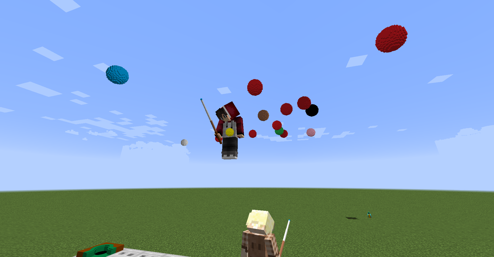

# _鱿鱼MC工作室_ 台球数据包

图中人物：[DaveHJT](https://github.com/DaveHJT)（中部）和[nzcsx](https://github.com/nzcsx)（底部）。

在Minecraft里体验最真实的台球游戏！

- [Abstract](#Abstract)
- [安装](#安装)
- [使用](#使用)
- [原理](#原理)
- [Notes](#Notes)
- [目录](#目录)
- [使用条款](#使用条款)
- [更多关于鱿鱼MC工作室](#更多关于鱿鱼MC工作室)

# Abstract
本数据包为广大我的世界、台球爱好者制作。

本数据包支持用我的世界Java Edition 1.16+游玩。由于本数据包涉及较多复杂运算，每个地图仅支持一张正在使用的球桌。

练习模式，英式八球，斯诺克模式已开发完成。

# 安装
- Step 01 下载代码压缩包并解压；
- Step 02 打开Minecraft路径，通常是 "C:/Users/youUserName/AppData/Roaming/.minecraft"；
- Step 03 将资源包压缩文件 "Pool-Resourcepack-Squid-Workshop-1.16.5" 放入 .../resourcepacks 文件夹，资源包与1.17兼容；
- Step 04 选择一个世界安装数据包，进入 .../saves/world/datapacks 文件夹；
- Step 05 将数据包文件夹 "Pool-Evolved-Datapack-Squid-Workshop-1.16-1.17" folder(not the root folder) 放入 .../saves/world/datapacks 文件夹；
- Step 06 打开Minecraft，进入对应世界；
- Step 07 按下Esc，进入设置...\资源包...，将资源包压缩文件移动到界面右上角，每次更换游戏版本都需要重新设置；
- Step 08 输入运行 "/reload" 指令；
- Step 09 开始游玩。

PS: 如果不能正常运行，以下指令可检查数据包是否被开启：

	/datapack list
以下指令可以开启数据包：

	/datapack enable "datapackname"
  
# 使用
## 互动
大部分互动不需要主动输入指令，您只需要点击<<ins>此格式的文字</ins>>或者选取指令和游戏自动提示的函数。

安装（reload）数据包后，聊天框中会出现 <<ins>可点击的文字</ins>> ，点击它可以打开“命令窗口”，一个多功能控制台。试着点击其中的文字进行探索吧。也可使用以下命令随时调出命令窗口。

	/function app:help/pool/commandwindow

如果第一次在世界中加载数据包，请点击文字选择语言和游戏版本，打开并补全提示指令设置摩擦系数，您之后也可以通过在游戏中补全以下命令调整：

	/function app:settings/pool/friction/
建议值: Impact:100-200, Rolling:150-300, Sliding:1500-3000, Striking:6000-8000。过大或过小的值可能会使计分板溢出，导致游戏异常。

多个设置可以修改：作用力的参数，以及是否允许撤销上一次击球等。具体请参照下方设置目录：

	/function app:settings/
注意：[旧版台球数据包](https://github.com/MingshiYangUIUC/Pool-Minecraft-Squid-Workshop-Project)和本数据包不兼容；暂不支持多个球桌同时运行；请关闭强制Unicode字体功能后体验。

## 操作
手持球杆时，按住右键蓄力，时间越久，击球力度越大。球初始运动方向与您的朝向相同。
手持球杆时，按住shift下蹲可以使您面向母球。
您可以设置是否在下蹲时添加缓慢效果来放大屏幕，这可以帮助您更精准的瞄准，但是在网络延迟较大时不建议使用。通过补全以下指令完成设置：

	/function app:settings/pool/aim/
击球前您可以点击<<ins>调整下一次击球<ins>>调整击球点位和球杆抬起角度。或以下指令：

	/function pool:classes/cue/map
缩多少
	
## 基础流程
按照[安装](#安装)教程安装数据包。

按照游戏内文字指示选择语言，游戏版本，摩擦力系数，和分数展示方式。

点击打开命令窗口，浏览[设置](#设置目录) 并按需要调整。

点击放置一张新球桌：按照文字提示选择球桌的长宽。

从命令窗口打开游戏大厅，如果您想进行多人游戏，您可以点击多人游戏队列。当您加入队列后，其他玩家会收到游戏邀请。

当您得知其他玩家加入了您的队列，按照提示点击开始与其开始游戏。

您也可以进行单人游戏，在单人斯诺克中您只需要得分超过犯规失去的分数即可击败您的虚拟对手。在单人英式八球中您“左右互搏”，所以没有输赢。

当斯诺克游戏结束时，玩家们会收到基于每回合平均得分的评级。

您可以通过命令窗口随时结束当前游戏。

_Under Development:_ Each window will eventually be attached a clickable instruction in game.

# 原理
简化的牛顿力学，包含各种使运算简单的假设。省略了袋角和球之间的摩擦力，以及所有物体的形变等。

让这个数据包运行，编写时我没有引用文献。您可以参考基础物理课本或者在互联网搜索“台球物理”。

为了方便游玩，简化后的斯诺克[规则](https://zh.wikipedia.org/wiki/%E6%96%AF%E8%AF%BA%E5%85%8B)和英式八球[规则](https://zh-yue.wikipedia.org/wiki/%E8%8B%B1%E5%BC%8F16%E6%B3%A2)被加入了数据包。球桌袋口的规格近似于2005年的斯诺克标准，它的图例及简化版可以在资源包贴图文件中找到。

由于代码量较多，如果游戏卡顿，可以考虑换电脑，或者玩[旧版](https://github.com/MingshiYangUIUC/Pool-Minecraft-Squid-Workshop-Project)。旧版不再被优化更新，也不支持1.17及以上版本。

# 注意
本数据包中球的建模较大，且包含众多简化的运算以使其在Minecraft中能够运行，您无法期望它完美地还原真实世界中的物理过程及表现形式，请多包涵。

# 目录
## 设置目录
	data/app/functions/settings		   注释
	+---cheating                               作弊设置
	|       allow.mcfunction                           开
	|       disallow.mcfunction                        关
	|       
	+---friction                               摩擦系数设置
	|       clear.mcfunction                           清除设置
	|       default.mcfunction                         全部使用默认设置
	|       impact.mcfunction                          碰撞系数单独设置
	|       rolling.mcfunction                         滚动系数单独设置
	|       sliding.mcfunction                         滑动系数单独设置
	|       striking.mcfunction                        击球系数单独设置
	|
	+---language                               语言设置
	|       chinese_simplified.mcfunction              简体中文
	|       english.mcfunction                         英语
	|       
	+---reload                                 重新加载时
	|       cleanongoingsession.mcfunction             终止并清除现有游戏及设施（球桌、球等）
	|       keepongoingsession.mcfunction              保留现有设施以待继续游戏
	|       
	\---version                                地图版本设置
		1_16.mcfunction                            1.16.x
		1_17.mcfunction                            1.17.x
		1_18.mcfunction                            1.18.x 及以上（暂时）
		reset.mcfunction                           重设
其余略

# 使用条款
如与其它内容有冲突，请参照此条款中内容。 \
请随意游玩此数据包，您也可以用它开发新的数据包。但是您 **必须** 在文件中提供并明显地引用此GitHub页面。\
**请勿用作商用** \
**若未经允许，禁止潜在的 (由鱿鱼MC工作室裁决) 商用行为。** 
## 协议
[Mozilla Public License 2.0](https://github.com/MingshiYangUIUC/Autoaim-Minecraft-Squid-Workshop-Project/blob/main/LICENSE)

# 更多关于鱿鱼MC工作室
我们开发的更多[数据包](https://github.com/Squid-Workshop/MinecraftDatapacksProject) \
我们的[B站主页](https://space.bilibili.com/649645265?from=search&seid=778816111336987286) \
QQ群: 74681732 \
微信公众号: 鱿鱼MC工作室 

*本文件转录自README.md
