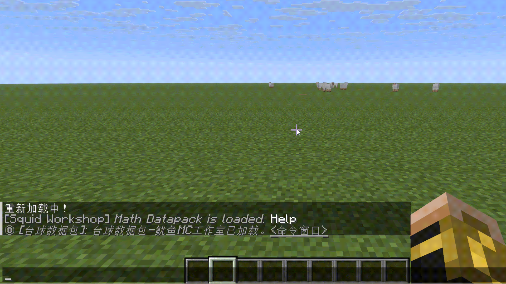
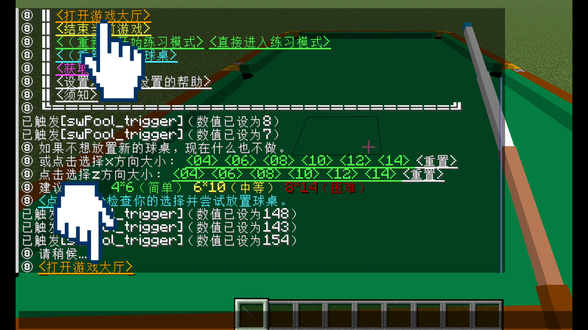
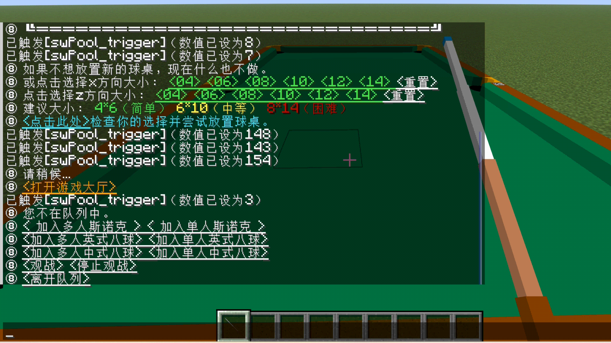
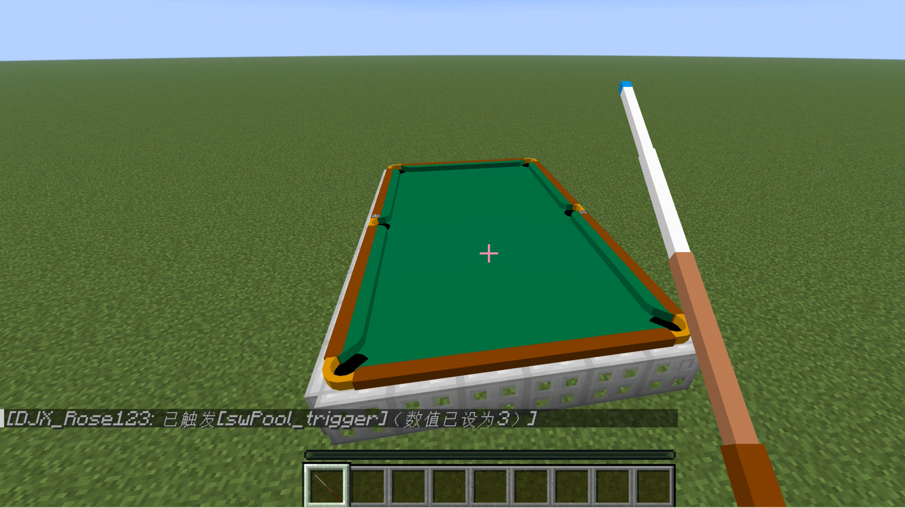
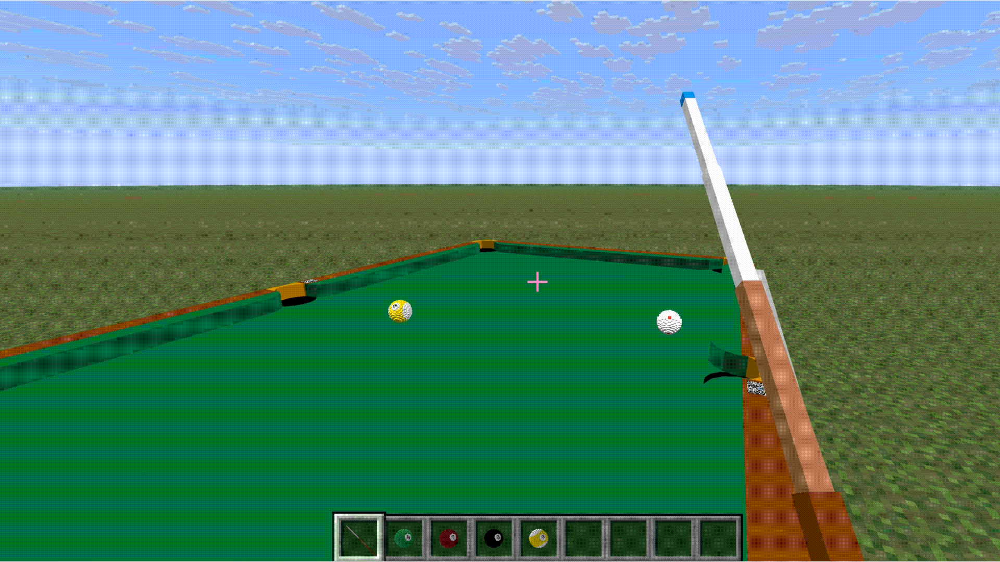

## 最近大更新

### 2025年7月 — 中式八球已加入数据包，现在可以从大厅进入游戏，开始体验！

这是一个长期项目......

- 起初，设计的球体只是静态模型，只能直线移动，无旋转效果。当时只计划制作斯诺克和英式八球，用的是单色球。
- 随后，通过引入更多物理模拟，支持了母球控制和台球旋转相关的物理，球的运动表现更加真实。
- 接着，将旋转信息映射为盔甲架姿态，实现了可视化旋转效果，并引入编号球（仅限练习模式）。这项技术实现早于 Minecraft 1.20 的 Transformation Rendering 功能推出。
- 现在，中式八球规则已完成，实现了带编号球的单人和多人完整玩法。

### 2025年七月 进行了 1.20 和 1.21 版本的更新，台球数据包现已适配 Minecraft 1.16 之后的所有版本!
Minecraft 1.21.X 带来了目录结构的重命名和大量命令语法的更改。现在已经不再适合在一个数据包文件中切换多个版本。资源包也发生了多处变化。 
数据包和资源包是基于 1.16-1.20 的内容使用[自动脚本](build_packs_for_1.21.py)生成的，该脚本进行必要的更改以使模块在新版本的 Minecraft 中按预期工作。

🔴如果使用的 Minecraft 版本是 1.21.X，请安装与游戏版本匹配的数据包和资源包。  
🔴在游戏中加载数据包时不再需要设定版本。  
🔴请同时确保安装了 1.21 版的 [数学数据包](https://github.com/MingshiYangUIUC/Math-Minecraft-Squid-Workshop-Project)。  
🔴目前，Windows 用户的快捷安装脚本不支持安装 1.21.X 版本的数据包与资源包。

---
# _鱿鱼MC工作室_ 台球数据包
内容创作者：杨铭石(YMS2001)。联系方式：mingshi3@illinois.edu  
在Minecraft里体验最真实的台球游戏！

---
# 目录
- [简介](#简介)
- [安装](#安装)
- [使用指南与演示](#使用指南与演示)
- [原理](#原理)
- [注意](#注意)
- [使用条款](#使用条款)
- [更多关于鱿鱼MC工作室](#更多关于鱿鱼MC工作室)

---
# 简介
本数据包为广大我的世界、台球爱好者制作。  
本数据包支持用我的世界Java Edition 1.16+游玩。每个地图仅支持一张正在使用的球桌。  
练习模式，中式八球，英式八球，斯诺克模式已开发完成。 

图中人物：[DaveHJT](https://github.com/DaveHJT)（中部）和[nzcsx](https://github.com/nzcsx)（底部）。

---
# 安装

### Windows 用户
[`swPool_sync.bat`](https://github.com/MingshiYangUIUC/Pool-Minecraft-Squid-Workshop-Project/blob/main/swPool_sync.bat) 可以从GitHub自动下载或升级 **台球数据包** 和它所需的 **数学数据包** 和 **资源包**。  
⚠️ 如果你更改了数据包代码，**不要使用** 这个脚本，因为之前下载的台球数据包/数学数据包会被删除。

### 或者可以跟随以下步骤
- Step 01 下载代码压缩包并解压；
- Step 02 打开Minecraft路径，通常是 "C:/Users/youUserName/AppData/Roaming/.minecraft"；
- Step 03 将资源包文件夹 "Pool-ResourcepackFolder-Squid-Workshop-（适配的游戏版本）" 放入 .../resourcepacks 文件夹，资源包与1.16+兼容；
- Step 04 选择一个世界安装数据包，进入 .../saves/world/datapacks 文件夹；
- Step 05 将数据包文件夹 "Pool-Datapack-Squid-Workshop-（适配的游戏版本）" folder 放入 .../saves/world/datapacks 文件夹；
- Step 06 打开Minecraft，进入对应世界；
- Step 07 按下Esc，进入设置.../资源包...，将资源包压缩文件移动到界面右上角，每次更换游戏版本都需要重新设置；
- Step 08 输入运行 "/reload" 指令；
- Step 09 开始游玩。

PS: 如果不能正常运行，以下指令可检查数据包是否被开启：

	/datapack list
以下指令可以开启数据包：

	/datapack enable "datapackname"
## 兼容性注意
尽管安装时游戏可能提示不兼容，数据包和资源包在多个游戏版本均可使用。如果您愿意，您可以自行根据这个[页面](https://minecraft.fandom.com/wiki/Pack_format)和您的游戏版本更改pack.mcmeta文件。

🔴 *我使用[数学数据包](https://github.com/MingshiYangUIUC/Math-Minecraft-Squid-Workshop-Project)替代台球数据包中的部分函数，请同时将它放入您的数据包库中。*

**如果数据包或资源包与Java Edition 1.16.1以上的任意版本不兼容，请告知我。**

---
# 使用指南与演示

大部分互动无需输入指令，只需点击聊天框中的 <<ins>此格式的文字</ins>> 或选择游戏自动提示的选项即可完成操作。  
🔔 建议关闭“强制 Unicode 字体”以获得更佳体验。

### 1. 初始化数据包

安装（reload）数据包后，聊天框中会指示之后的操作，点击它可以打开“命令窗口”，一个多功能控制台。也可使用以下命令随时调出命令窗口。

	/function app:help/pool/commandwindow

如果第一次在世界中加载数据包，请点击<<ins>此格式的文字</ins>>选择语言和游戏版本（1.21及以上的版本不需要选择），并补全摩擦参数设置。上图示例使用默认值。  
🔴 请确认也加载了数学数据包。

### 2. 加载资源包

将资源包放进对应文件夹后可能需要手动在游戏里添加，请确认加载的资源包的版本是正确的。

### 3. 设置以及设置的帮助

您可以在命令窗口中访问所有设置。详细介绍请点击命令窗口下方文字<<ins>关于设置的帮助</ins>>  
多个设置可以修改：例如作用力的参数，是否让球旋转，能否作弊，白球的外观等。运行时请参照下方设置目录：

	/function app:settings/
参数的建议值在调整时会显示。过大或过小的值可能会使计分板溢出，导致游戏异常。

### 4. 获得球杆

通过与命令窗口交互获得球杆（没有正在运行的台球游戏时，球杆是弓）。

### 5. 放置球桌

通过与命令窗口交互摆放新的球桌，现有的球桌会被移除。您可以自由选择球桌的长宽尺寸（米），小球桌会减少斯诺克的红球数量，大球桌通常代表游戏会更困难。

### 6. 打开游戏大厅

用命令窗口或者在放置球桌后<<ins>打开游戏大厅</ins>>，单人游戏和多人游戏都从游戏大厅进入。您也可以选择观战（收到正在游玩的玩家的游戏交互信息如分数等）。

### 7. 开始单人游戏

在游戏大厅中选择一个游戏的单人模式，确认之后即可开始游戏。游戏的交互信息包含目标球，分数等，会在左下角通过聊天框显示。  
在单人斯诺克中您只需要得分超过犯规失去的分数即可击败您的虚拟对手。在单人八球中您“左右互搏”，所以没有输赢。  
当斯诺克游戏结束时，玩家们会收到基于每回合平均得分的评级。

当母球不在桌面时（例如开球前）您需要放置母球，如果您手持母球并站在球桌上或球桌旁的地面，扫过桌面时您会发现可放置母球的区域会有绿色颗粒显示。

### 8. 开始多人游戏

在游戏大厅中选择一个游戏的多人模式后，其他在线玩家会收到广播邀请。当您得知其他玩家加入了您的队列，按照提示点击<<ins>开始</ins>>与其开始游戏。开球的玩家随机决定。

### 9. 击球

使用鼠标右键蓄力，松开右键出杆。击球时母球的初始运行方向由玩家朝向角度决定，母球的初始速度由按住右键的时间决定，最大力度的击球需要1.1秒左右的蓄力。中式八球和英式八球开球时球速会比通常击球时快0.4米每游戏刻（8米每秒）。  
瞄准方法：手持球杆按住潜行键时，玩家会朝向母球，此时击球时母球运动方向即为正前方。

您可以设置是否在下蹲时添加缓慢效果来放大屏幕，这可以帮助您更精准的瞄准，但是在网络延迟较大时不建议使用。通过补全以下指令完成设置：

	/function app:settings/pool/aim/

### 10. 控制母球

击球时除了力度大小，也可以调整给母球施加的初始旋转。击球前您可以点击 <<ins>调整下一次击球</ins>> 调整击球点位和球杆抬起角度。或以下指令：

	/function pool:classes/cue/map
在这个调整界面中，击打点位以左侧点阵表示，球杆抬起角度在右侧可供选择，下方可以进行击球点位的微调，极大增加选点的自由度。 
GIF显示了击打在低杆点位的效果。

### 11. 撤销上次击球

如果在设置中开启了作弊，击球后可以点击<<ins>撤销上次击球</ins>>将球桌上的球还原到击球前的状态，只能撤销一次。在游戏中，撤销击球玩家的目标球也应不变（如果玩家应该击打花色球却击打了全色球并犯规，可以撤销后重新击打花色球，犯规也会被撤销）。

### 12. 练习模式

可以从命令窗口进入没有规则的练习模式。在这个模式中玩家拥有所有球，玩家可以随意将它们摆放在球桌上任意位置并击打。

---
# 原理
本数据包使用简化的牛顿力学进行建模，忽略了袋口摩擦、球与球之间的变形、能量损失等因素，力求在 Minecraft 中实现近似的真实物理行为。

目前已模拟以下机制：
- 动量守恒、角动量守恒与动能传递
- 母球击球点与球杆抬起角度影响旋转的建模
- 与袋口边缘的交互（但不包含袋口摩擦力）

物理部分为原创设计，未参考文献。如需深入了解可参考基础力学课本，或搜索关键词如 “台球物理” / “billiard physics”。

---
# 注意事项
1. **球的尺寸略大于现实**，这是为了提高可控性和游戏体验。真实尺寸虽然更接近现实，但在 Minecraft 的鼠标灵敏度下极难精准操作球杆。希望您理解这种“对现实的不忠”，是为了带来更好的游玩体验。

2. **请勿未经署名传播本数据包内容**。虽然物理内容大多为通识知识，但本数据包中所有建模与实现均为本人独立完成，未引用具体论文文献。如需深入了解，请参阅上方 _How It Works_，或在线搜索 “not so simple billiards physics”。

3. **斯诺克与英式八球规则已作简化**，以提升可玩性与易用性。您可以参考：[斯诺克规则](https://zh.wikipedia.org/wiki/%E6%96%AF%E8%AF%BA%E5%85%8B)、[英式八球规则](https://zh-yue.wikipedia.org/wiki/%E8%8B%B1%E5%BC%8F16%E6%B3%A2)。   英文参考：[Snooker Rules](https://en.wikipedia.org/wiki/Rules_of_snooker)、[8 Ball Rules](https://en.wikipedia.org/wiki/Blackball_(pool))

4. 资源包中包含简化后的球桌袋口图示，贴近 2005 年斯诺克标准球桌袋口尺寸。您可以在资源贴图文件中查看。

---
# 使用条款
如与其它内容有冲突，请参照此条款中内容。  
请随意游玩此数据包，您也可以用它开发新的数据包。但是您 **必须** 告知我们，并在文件中提供并明显地引用此GitHub页面。 
**请勿用作商用；若未经允许，禁止潜在的 (由YMS2001或鱿鱼MC工作室裁决) 商用行为。** 
## 协议
[Mozilla Public License 2.0](https://github.com/MingshiYangUIUC/Autoaim-Minecraft-Squid-Workshop-Project/blob/main/LICENSE)

---
# 更多关于鱿鱼MC工作室
我们开发的更多[数据包](https://github.com/Squid-Workshop/MinecraftDatapacksProject)  
我们的[youtube主页](https://www.youtube.com/channel/UCwPMgfjjh2d7fFqQ1PXHP7w)  
我们的[B站主页](https://space.bilibili.com/649645265?from=search&seid=778816111336987286)  
QQ群: 74681732  
微信公众号: 鱿鱼MC工作室 
